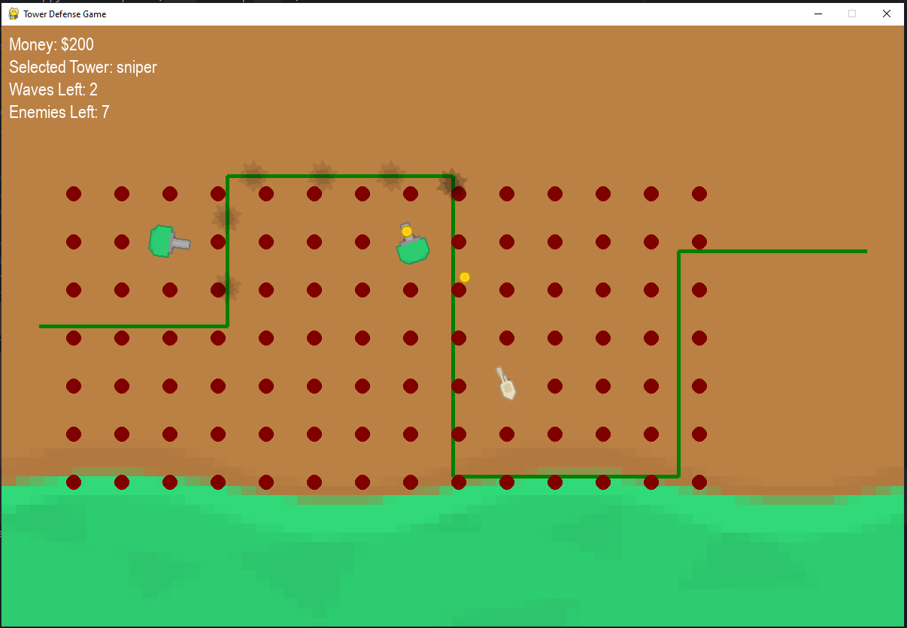
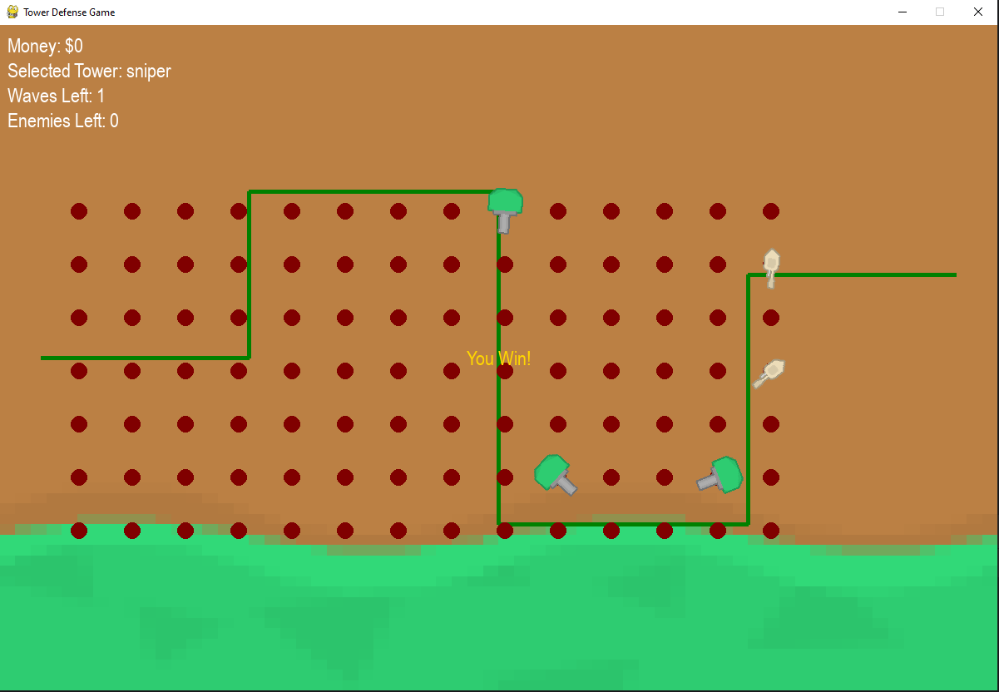
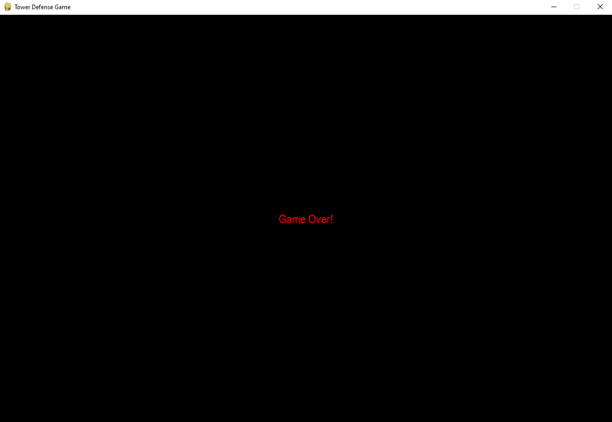

# Tower Defense Game

## Описание

Tower Defense Game — это классическая игра в жанре tower defense, где игрок должен защищать свою базу от волн врагов, размещая башни на карте. Цель игры — уничтожить всех врагов до того, как они достигнут конца пути.

## Установка

1. Убедитесь, что у вас установлен Python 3.x и библиотека Pygame.

2. Клонируйте репозиторий:
```bash
git clone https://github.com/yourusername/tower-defense-game.git
```

3. Перейдите в директорию проекта:
```bash
cd tower-defense-game
```

4. Запустите игру:
```bash
python main.py
```

## Управление
- 1: Выбрать базовую башню.
- 2: Выбрать снайперскую башню.
- 3: Выбрать денежную башню (генерирует деньги).
- Пробел: Показать/скрыть доступные позиции для башен.
- ЛКМ: Разместить выбранную башню на карте.
- U: Улучшить башню (наведите курсор на башню и нажмите U).

## Особенности
- Башни:
  - Базовая башня: Средний урон, средняя скорость атаки.
  - Снайперская башня: Высокий урон, низкая скорость атаки, атакует самого здорового врага в радиусе.
  - Денежная башня: Генерирует деньги каждые 5 секунд.

- Система улучшений башен:
  - Каждое улучшение стоит 50 * уровень башни (например, улучшение с уровня 1 на уровень 2 стоит 50, с уровня 2 на 
уровень 3 — 100 и т.д.).
  - Улучшение увеличивает урон башни на 20% и уменьшает задержку между выстрелами на 20%.
  - Чтобы улучшить башню, наведите на неё курсор и нажмите клавишу U.

- Враги:
  - Базовый враг: Низкое здоровье, средняя скорость.
  - Быстрый враг: Низкое здоровье, высокая скорость.
  - Сильный враг: Высокое здоровье, низкая скорость.

- Волны: 
  - Игра состоит из нескольких волн врагов, каждая из которых становится сложнее.
  - Враги появляются с разными характеристиками: быстрые, но слабые, и медленные, но сильные.

- Звуки:
    - Звук выстрела башен (shoot.wav).
    - Звук появления врагов (enemy_hit.wav).

## Скриншоты
Волны врагов
1. **Размещение башен**



2. **Победа в игре**




3. **Игра окончена**



## Структура проекта
- main.py: Основной файл игры, запускает игру и управляет основным циклом.
- settings.py: Настройки игры, включая размеры экрана, пути к спрайтам и параметры башен.
- level.py: Управление уровнями, волнами врагов и башнями.
- tower.py: Классы башен и их логика.
- enemy.py: Классы врагов и их поведение.
- bullet.py: Класс пуль, выпускаемых башнями.
- grid.py: Управление сеткой и позициями для башен.

## Новые возможности
- **Начисление денег за уничтожение врагов:** Теперь за уничтожение врагов игрок получает деньги, которые можно тратить на 
улучшение башен.
- **Разнообразие врагов:** Добавлены быстрые, но слабые враги, а также медленные, но сильные враги.
- **Гибкая настройка волн:** Волны теперь содержат врагов с разными характеристиками, что делает игру более интересной.

## Автор
Вереин Михаил Павлович 
verein83@mail.ru